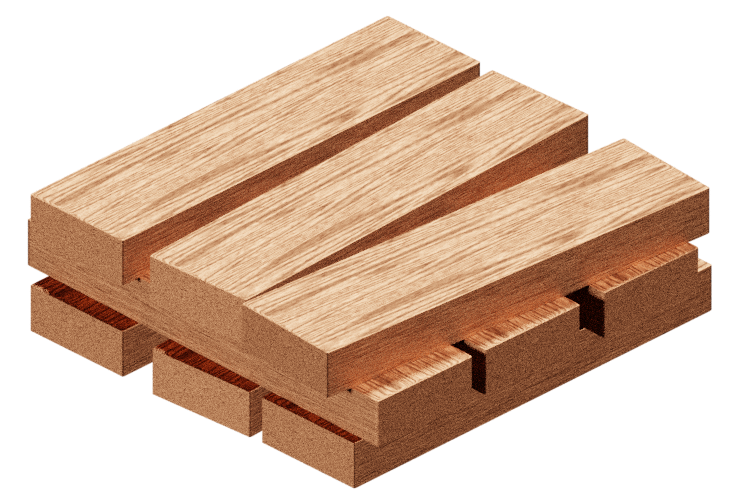

<p align=center></p>
<h3 align=center>f o u n d a t i o n</h3>
<h6 align=center>Build your Docker containers on a solid foundation</h6>

# Description

Foundation intends to be a super lightweight base image for Docker applications. Foundation is influenced by [phusion/baseimage](https://github.com/phusion/baseimage-docker); however, it is built upon [alpine](https://github.com/gliderlabs/docker-alpine) and includes only a minimal set of tools compared to `phusion/baseimage`, allowing Foundation to act as a unopinionated, extendable base image while also keeping the image size to a minimum.

## Tools included

Foundation includes only two tools: [tini](https://github.com/krallin/tini), to ensure the container has a valid init process that reaps zombie processes; and [su-exec](https://github.com/ncopa/su-exec), to help with running commands as other users.

## Using as a base image

Foundation is super simply to use: simply make a Dockerfile that inherits from Foundation, add your build instructions, and set a `CMD`. Foundation will pass whatever you set as the arguments to `CMD` to `tini` when the container is started. Make sure to use the exec style, as opposed to the shell style, when setting `CMD`.

```Dockerfile
FROM hipaapotomous/foundation:<VERSION>

# ...build instructions here...

CMD [ "exe_name_here", "arg1" ]
```
